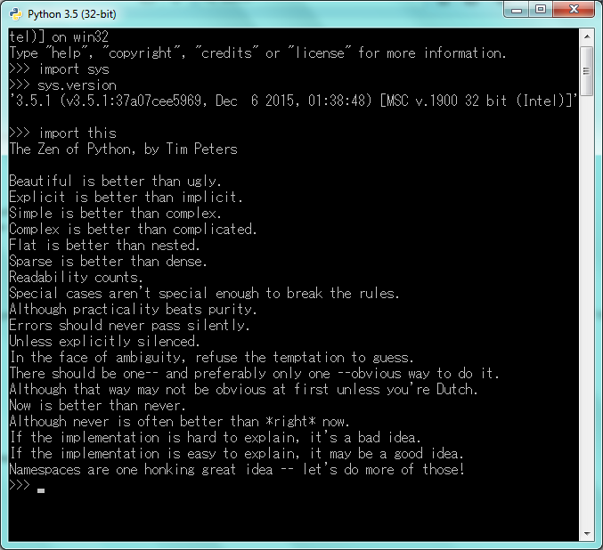

UECM3033 Assignment #1 Report
========================================================

- Prepared by: **LEM WEI HAO**
- Tutorial Group: T2

--------------------------------------------------------

## Task 1 -- setup a github repository

The reports, codes and supporting documents are uploaded to Github at: 

[https://github.com/weihaolem/UECM3033_assign1](https://github.com/weihaolem/UECM3033_assign1)

---------------------------------------------------------

## Task 2 -- setup python

Put here the screen shot of file (python.png)

------------------------------------------------------------

## Task 3 -- modify and run Python script

In this section, please report:

1. The hexadecimal value of student ID.
2. The definite integrals that have chosen.
3. System of 10 linear equations.

#####answers:
1. The hexadecimal representation of 1302054 is **0x13de26**
2. $$ \int_0^1 {x(x-x^2)^4}/{1+x^2}dx = {22}/{7}-\pi $$
    
    

3. \begin{align*}
3 x_0 +x_1 +5 x_2 +4 x_3 +8 x_4 +9 x_5 +4 x_6 +6 x_7 +2 x_8 +8 x_9 &= 2,\\
x_0 +2 x_1 +8 x_2 +7 x_3 +x_4 +6 x_5 +2 x_6 +5 x_7 +4 x_8 +9 x_9 &= 5,\\
9 x_0 +7 x_1 +x_2 +5 x_3 +4 x_4 +8 x_5 +2 x_6 +6 x_7 +3 x_8 +x_9 &= 6,\\
4 x_0 +3 x_1 +5 x_2 +6 x_3 +7 x_4 +2 x_5 +8 x_6 +4 x_7 +5 x_8 +7 x_9 &= 4,\\
4 x_0 +7 x_1 +x_2 +5 x_3 +2 x_4 +4 x_5 +8 x_6 +6 x_7 +3 x_8 +x_9 &= 5,\\
3 x_0 +4 x_1 +8 x_2 +5 x_3 +7 x_4 +x_5 +2 x_6 +2 x_7 +4 x_8 +1 x_9 &= 8,\\
x_0 +7 x_1 +4 x_2 +6 x_3 +10 x_4 +15 x_5 +4 x_6 +8 x_7 +3 x_8 +x_9 &= 1,\\
5 x_0 +6 x_1 +8 x_2 +2 x_3 +7 x_4 +4 x_5 +3 x_6 +9 x_7 +x_8 +5 x_9 &= 2,\\
9 x_0 +7 x_1 +2 x_2 +4 x_3 +6 x_4 +x_5 +5 x_6 +3 x_7 +8 x_8 +4 x_9 &= 5,\\
6 x_0 +4 x_1 +7 x_2 +5 x_3 +8 x_4 +3 x_5 +2 x_6 +x_7 +5 x_8 +4 x_9 &= 6.
\end{align*}

    
    
    
    
    
    
    
    
    
    

    _Solution(accending order, x_0 to x_9) =  
    [ 1.54210121 -2.46435204  1.99384451 -0.68636592 -1.25595756  0.85227156 1.2679462   0.53779707  1.78760146 -2.11028303]_

-----------------------------------

last modified: 25 January 2015
